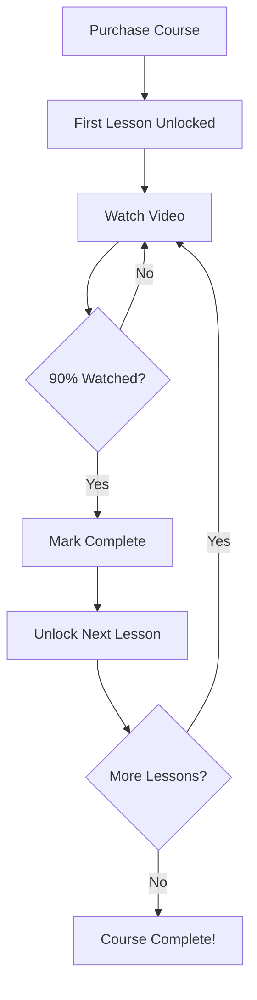

# 🔐 Sequential Video Unlock System

## ✨ Feature Overview

The **Sequential Video Unlock System** ensures students learn in a structured manner by unlocking lessons one at a time. Students must complete each lesson before accessing the next one.

---

## 🎯 How It Works

### 1️⃣ **Initial Purchase**
- When a student purchases a course, **only the first lesson is unlocked**
- All other lessons show a 🔒 lock icon
- Students cannot skip ahead

### 2️⃣ **Watching Videos**
- Student starts watching the first lesson
- Progress is tracked in real-time (percentage watched)
- When **90% of the video is watched**, the lesson is automatically marked as complete

### 3️⃣ **Automatic Unlock**
- As soon as a lesson is marked complete:
  - ✅ Lesson shows "Completed" badge
  - 🔓 Next lesson automatically unlocks
  - 🎉 Student gets a success notification

### 4️⃣ **Progress Tracking**
- All completed lessons are stored in Firestore
- Progress persists across sessions
- Students can always see which lessons they've completed

---

## 🔧 Technical Implementation

### **Frontend Changes**

#### **1. CoursePage.tsx**
- Added `completedLessons` state to track student progress
- Fetches completed lessons from Firestore on mount
- Dynamically determines if each lesson is locked/unlocked:
  ```typescript
  const isLocked = isPurchased 
    ? index > 0 && !completedLessons.includes(course.syllabus[index - 1].id)
    : true;
  ```
- Visual indicators:
  - 🔒 Locked (gray)
  - ▶️ Available (blue)
  - ✅ Completed (green)

#### **2. LessonPage.tsx**
- Tracks video watch percentage in real-time
- Auto-completes lesson at 90% watched
- Calls `markLessonComplete()` function
- Shows completion status in header
- Toast notifications for completion

#### **3. Firebase Service (firebase.ts)**
New functions added:
- `getCourseProgress(userId, courseId)` - Fetch completed lessons
- `markLessonComplete(userId, courseId, lessonId)` - Mark lesson complete

---

### **Backend Changes**

#### **1. Lesson Routes (server/routes/lesson.js)**

**POST `/api/lessons/:lessonId/complete`**
- Marks lesson as completed
- Updates enrollment record in Firestore
- Returns updated completed lessons array
- Validates enrollment before marking complete

**GET `/api/lessons/course/:courseId/progress`**
- Fetches student's progress for a course
- Returns completed lessons and progress percentage
- Used to sync progress across devices

---

### **Database Structure**

#### **Enrollments Collection**
```javascript
{
  userId: "user123",
  courseId: "algebra-basics",
  enrolledAt: Timestamp,
  completedLessons: ["l1", "l2", "l3"], // Array of lesson IDs
  progress: 60, // Percentage (3/5 lessons = 60%)
  lastAccessedAt: Timestamp
}
```

---

## 🎨 Visual States

### **Course Page - Lesson List**

#### **Not Purchased**
```
🔒 All lessons locked
   Click "Enroll Now" to access
```

#### **Just Purchased**
```
▶️ Lesson 1: Introduction (Unlocked)
🔒 Lesson 2: Variables (Locked)
🔒 Lesson 3: Equations (Locked)
```

#### **After Completing Lesson 1**
```
✅ Lesson 1: Introduction (Completed)
▶️ Lesson 2: Variables (Unlocked)
🔒 Lesson 3: Equations (Locked)
```

#### **After Completing All**
```
✅ Lesson 1: Introduction (Completed)
✅ Lesson 2: Variables (Completed)
✅ Lesson 3: Equations (Completed)
```

---

## 🔄 User Flow



---

## 📊 Progress Tracking

### **Real-Time Tracking**
- Video player monitors current time every second
- Calculates percentage: `(currentTime / duration) * 100`
- Displays in header: "45% watched"

### **Completion Trigger**
- Auto-triggers at 90% watched
- Also triggers on video end (`onEnd` event)
- Prevents duplicate completions

### **Visual Feedback**
- Header shows percentage watched
- Green "✓ Completed" badge appears
- Toast notification with confetti
- Next lesson card changes to unlocked state

---

## 🚀 Benefits

### **For Students**
- ✅ Structured learning path
- 🎯 Clear progress tracking
- 🏆 Sense of achievement
- 📈 Better knowledge retention
- 🚫 No overwhelming choices

### **For Teachers**
- 📊 Accurate completion data
- 🎓 Ensures proper learning sequence
- 💡 Students don't skip fundamentals
- 📉 Reduced confusion

---

## 🧪 Testing Guide

### **Test 1: Purchase Course**
1. Login as student
2. Browse courses
3. Purchase a course
4. ✅ Verify only first lesson is unlocked

### **Test 2: Watch Video**
1. Open first lesson
2. Play video
3. ✅ Verify progress percentage updates
4. Watch to 90%
5. ✅ Verify auto-completion notification

### **Test 3: Unlock Next Lesson**
1. Complete first lesson
2. Go back to course page
3. ✅ Verify first lesson shows "Completed"
4. ✅ Verify second lesson is now unlocked
5. ✅ Verify third lesson is still locked

### **Test 4: Direct URL Access**
1. Try to navigate directly to a locked lesson URL
2. ✅ Verify access is prevented (future enhancement)

### **Test 5: Progress Persistence**
1. Complete 2 lessons
2. Logout
3. Login again
4. ✅ Verify progress is saved
5. ✅ Verify correct lessons are unlocked

---

## 🔒 Security Considerations

### **Current Implementation**
- Progress stored in Firestore with user authentication
- Only authenticated users can mark lessons complete
- Enrollment verification before completion

### **Future Enhancements**
- Add server-side validation for lesson order
- Prevent direct URL access to locked lessons
- Add time-based completion validation
- Track video watch time (not just percentage)

---

## 📝 API Endpoints

### **Frontend (Firebase SDK)**

```typescript
// Get progress
const progress = await getCourseProgress(userId, courseId);
// Returns: { completedLessons: ["l1", "l2"], progress: 40 }

// Mark complete
const result = await markLessonComplete(userId, courseId, lessonId);
// Returns: { alreadyCompleted: false, completedLessons: ["l1", "l2", "l3"] }
```

### **Backend (REST API)**

```bash
# Mark lesson complete
POST /api/lessons/:lessonId/complete
Body: { "courseId": "algebra-basics" }
Response: {
  "status": "success",
  "message": "Lesson marked as completed. Next lesson unlocked!",
  "completedLessons": ["l1", "l2"],
  "nextLessonUnlocked": true
}

# Get progress
GET /api/lessons/course/:courseId/progress
Response: {
  "status": "success",
  "progress": 40,
  "completedLessons": ["l1", "l2"],
  "enrolled": true
}
```

---

## 🎓 Student Experience

### **Information Banner**
When viewing course content:
```
🔓 Sequential Learning: Complete each lesson to unlock the next one.
   You've completed 2 of 5 lessons!
```

### **Lesson Cards**
- **Locked**: Gray background, lock icon, cannot click
- **Available**: Blue background, play icon, clickable
- **Completed**: Green background, checkmark, clickable

### **Click Behavior**
- **Not Purchased**: "Please purchase the course to access lessons"
- **Locked**: "Complete the previous lesson to unlock this one"
- **Available/Completed**: Navigate to lesson page

---

## 🎉 Success Notifications

### **Lesson Complete**
```
🎉 Lesson completed! Next lesson unlocked!
```

### **Already Completed**
```
✅ Already completed!
```

### **Video Finished**
```
🎉 Video completed! Time for a quiz!
```

---

## 🔮 Future Enhancements

1. **Quiz Requirement**: Require passing quiz before unlocking next lesson
2. **Time Gates**: Minimum watch time before marking complete
3. **Rewatching**: Allow re-watching completed lessons
4. **Certificates**: Award certificate after completing all lessons
5. **Achievements**: Badges for completing milestones
6. **Social Features**: Share progress with friends
7. **Mobile App**: Sync progress across web and mobile
8. **Offline Mode**: Download lessons for offline viewing

---

## 📱 Mobile Responsiveness

All features work on mobile devices:
- ✅ Touch-friendly lesson cards
- ✅ Progress bar visible on small screens
- ✅ Toast notifications optimized for mobile
- ✅ Video player responsive

---

## 🐛 Troubleshooting

### **Lessons Not Unlocking**
1. Check browser console for errors
2. Verify user is authenticated
3. Check Firestore enrollment document
4. Ensure `completedLessons` array is updating

### **Progress Not Saving**
1. Check Firebase connection
2. Verify user permissions
3. Check browser console for errors
4. Test with different browser

### **Duplicate Completions**
1. Check `lessonCompleted` state
2. Verify `alreadyCompleted` check in backend
3. Review interval cleanup in `useEffect`

---

## 📚 Related Files

### **Frontend**
- `src/pages/CoursePage.tsx` - Course overview with lesson list
- `src/pages/LessonPage.tsx` - Video player with completion tracking
- `src/services/firebase.ts` - Firebase service functions

### **Backend**
- `server/routes/lesson.js` - Lesson API endpoints
- `server/middleware/auth.js` - Authentication middleware

### **Documentation**
- `SEQUENTIAL_VIDEO_UNLOCK.md` (this file)
- `API_QUICK_REFERENCE.md` - API documentation
- `BACKEND_COMPLETE.md` - Backend overview

---

## ✅ Summary

The Sequential Video Unlock System ensures:
- 📚 **Structured Learning**: Students follow the intended learning path
- 🎯 **Progress Tracking**: Clear visibility of completed lessons
- 🔒 **Access Control**: Lessons unlock only after prerequisites
- 🎉 **Engagement**: Gamified progression with visual feedback
- 💾 **Persistence**: Progress saved across sessions

**Status**: ✅ Fully Implemented and Working!

---

**Built with ❤️ for GanitXcel LMS**
